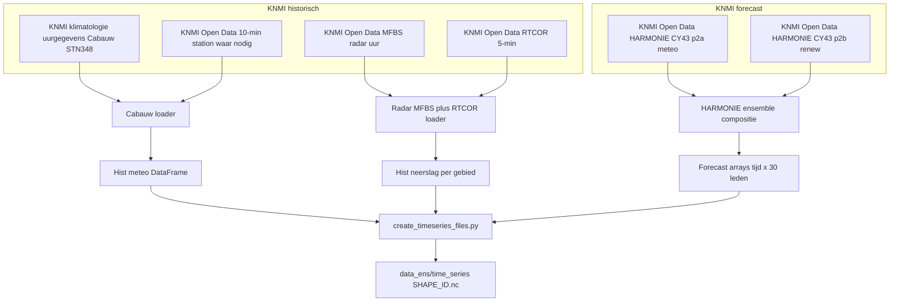

# HDSR Afvoervoorspelling met Neural Hydrology

Dit project gebruikt deep learning (LSTM) modellen om afvoeren te voorspellen voor de afvoergebieden van Hoogheemraadschap De Stichtse Rijn (HDSR). Het project is gebaseerd op de [neuralhydrology](https://github.com/neuralhydrology/neuralhydrology) bibliotheek.

## Overzicht

Het project bevat experimenten met verschillende LSTM varianten voor het voorspellen van afvoeren in 40 polders/afvoergebieden binnen het beheergebied van HDSR. De modellen gebruiken meteorologische data en gebiedskenmerken om accurate afvoervoorspellingen te maken.

## Projectstructuur

```
neural_hydrology/
├── README.md                 # Dit bestand
├── .gitignore               # Git ignore configuratie
├── config.yml               # NeuralHydrology run-config (data, model, features, train/valid/test)
├── scripts/                 # Python scripts
│   ├── training/           # Training scripts
│   ├── analysis/           # Analyse en evaluatie scripts
│   └── preprocessing/      # Preprocessing/hulpscripts
├── data/                   # Dataset
│   ├── attributes/         # Gebiedskenmerken van polders
│   ├── time_series/        # Tijdreeks data (voorbeelden)
│   └── hdsr_polders.txt    # Lijst van ids afvoergebieden
└── notebooks/              # Jupyter notebooks voor analyse
```

## Datasets

### Afvoergebieden

Het project werkt met 40 afvoergebieden van HDSR. De lijst staat in `data/hdsr_polders.txt`.

### Data bestanden

- **Attributes**: `polders_data_aangevuld.csv` - Gebiedskenmerken van alle polders
- **Time series**: NetCDF bestanden (`.nc`) met meteorologische en hydrologische tijdreeksen per polder
- **Voorbeelden**: Alleen AFVG1, AFVG13 en AFVG15 zijn meegeleverd als voorbeelden (vanwege bestandsgrootte)
- **Let op**: De volledige `time_series/` (NetCDF) dataset wordt in Databricks gebruikt vanaf een Volume (zie `config.yml`) en zit niet in deze repository.

## Model varianten

Het project test verschillende LSTM configuraties:

1. **MTSLSTM** - Multi-Timescale LSTM
2. **MTSLSTM + Embedding** - Met embedding layer voor categorische features
3. **MTSLSTM + One-Hot Encoding** - Met one-hot encoded features
4. **Statische Multi-Timescale LSTM** - Varianten met statische features

De configuratie van een run staat in `config.yml`. Voor experimenten maak je hiervan doorgaans varianten (bijv. per model/feature-set).

## Belangrijkste scripts

### Training

- `batch_train_single.py` - Batch training voor single LSTM model per afvoergebied
- `run_model.py` - Basis model training script voor een of meerdere configuraties
- `hyperparameter_optimalisatie.py` - Optuna hyperparameter optimalisatie (Databricks + MLflow)
- `batch_train_model.py` - Retrain/ensemble op basis van gekozen HPO trial (Databricks + MLflow)

### Analyse

- `best_model.py` - Evaluatie van beste modellen
- `map_hdsr.py` - Visualisatie van HDSR gebied

## Lokaal gebruik

### Installatie

```bash
# (Aanbevolen) maak een virtuele omgeving en installeer dependencies voor dit project
python -m venv .venv
source .venv/bin/activate
pip install -r neural_hydrology/requirements.txt

# Of kloon de repository en installeer lokaal
git clone https://github.com/neuralhydrology/neuralhydrology.git
cd neuralhydrology
pip install -e .
```

### Training

```bash
# Train een model met de configuratie in neural_hydrology/config.yml
python neural_hydrology/scripts/training/run_model.py

# Batch training voor single LSTM model per afvoergebied
python neural_hydrology/scripts/training/batch_train_single.py
```

### Analyse

```bash
# Evaluatie/overzicht beste modellen
python neural_hydrology/scripts/analysis/best_model.py
```

## Databricks

Deze branch is bedoeld om het NeuralHydrology-framework te draaien op Databricks. De scripts in `scripts/training/` zijn hierop ingericht (paden onder `Workspace` en `Catalog/Volumes`, rekenkracht via `Compute`, en MLflow tracking via `Jobs & Pipelines`). In het project is gewerkt in de instantie `dbw-datascience-tst-weu-001` binnen Databricks.

### Installatie en update van repo in Databricks

#### Repo toevoegen als Git folder (eerste keer)

- **Workspace locatie kiezen**: ga naar *Workspace* en navigeer naar de plek waar je de projectfolder wilt hebben, bijv. onder `Shared` of onder `Users` → `rob.van.den.hengel@hdsr.nl`.
- **Git folder aanmaken**: rechtermuisknop op de map waarin je het project wilt plaatsen → *Create* → *Git folder*.
- **URL plakken**: plak de Git-URL van de repository bij *URL*.
- **Naam instellen**: pas indien nodig de *Name* aan zoals die in Databricks getoond wordt. Deze naam moet **uniek** zijn binnen die locatie in Databricks.
- **Aanmaken**: klik *Create Git folder* en selecteer (indien gevraagd) direct de juiste branch.
- **In dit project**: in dit project zijn folders gebruikt onder `Workspace/Shares/neural_hydrology` en `Workspace/Shares/neural_hydrology_fork`. `neural_hydrology_fork` is gebruikt vanwege beperkte rechten op het GitHub-account `hdsr-mid`, en zodoende om via een gesyncte fork te werken met het account `robvandenhengelhdsr`.

#### Repo updaten (na wijzigingen buiten Databricks)

- **Navigeer naar de Git folder**: ga in *Workspace* naar de Git folder van het project.
- **Open Git-menu**: klik op het Git-icoon rechts naast de naam van de Git folder (knop met Git-logo + branchnaam).
- **Lokale wijzigingen eerst veiligstellen (best practise)**: als er in Databricks lokale wijzigingen zijn, commit en push die eerst naar GitHub voordat je gaat pullen.
- **Branch kiezen**: selecteer linksboven de branch die je uit GitHub wilt ophalen/gaan gebruiken in Databricks.
- **Pull uitvoeren**: klik rechtsboven op *Pull* om de laatste wijzigingen op te halen.
- **Let op paden naar `config.yml`**: sommige scripts verwijzen naar een vaste plek voor de basisconfig, bv. `BASE_CONFIG = "/Workspace/Shared/neural_hydrology_fork/config.yml"`. Zorg dat dit pad klopt voor jouw Git folder-locatie in *Workspace*.

#### Data Volume (input/output)

- **Dataset**: de repo bevat niet de trainingsdataset vanwege de omvang. Binnen Databricks zijn datasets beschikbaar via de *Catalog*.
- **Volume**: voor dit project is in de Catalog een Volume aangemaakt in de database `default` met de naam `data_neuralhydrology`.
  - **Input**: subfolder `input` bevat de benodigde gegevens (tijdseries & gebiedskenmerken) voor training.
  - **Output**: subfolder `output` is bedoeld voor het wegschrijven van modelresultaten.

#### Compute aanmaken of starten

- **Computeless werken**: je kunt (deels) zonder compute werken, maar dan kun je bijvoorbeeld geen terminal openen om via command line te werken en niet alle workloads draaien.
- **Nieuwe compute**: ga naar *Compute* → *Create compute* en volg de instructies. Voor GPU-training kies je een cluster met CUDA/GPU runtime. De scripts schakelen automatisch tussen GPU/CPU op basis van `torch.cuda.is_available()`.
- **Bestaande compute starten**: ga naar *Compute* en klik op het *Play*-icoon (driehoek naar rechts) bij de gewenste compute (verschijnt bij hover).

#### Libraries installeren op de compute

- Klik op de compute → tab *Libraries* → *Install new*.
- Navigeer naar `requirements.txt` en klik *Install*.

#### Script als Job draaien (optioneel, aanbevolen voor reproduceerbare runs)

- **Nieuwe job aanmaken**:
  - Ga naar *Jobs & Pipelines* → *Create* → *Job*.
  - Kies het juiste task type: *Python script*, *Notebook* of *Add another task type*. In dit project is dit meestal *Python script*.
  - Vul *Task name* in.
  - Kies onder *Compute* de compute waarop de job moet draaien.
  - Kies onder *Path* het `.py` script dat je wilt uitvoeren en selecteer dit.
  - Klik *Create task*.
- **Job starten**:
  - Controleer of de compute aan staat.
  - Open de job en klik rechtsboven op *Run now*.

### Uitvoeren van runs voor training (incl. opzet hyperparameter optimalisatie)

#### Training van één run

- **Configuratie**: `neural_hydrology/config.yml` is de centrale config.
  - **Data**: in deze branch wijst `data_dir` naar een Databricks Volume genaamd `/Volumes/dbw_datascience_tst_weu_001/default/data_neuralhydrology/input`.
  - **Outputs**: Op Databricks schrijft de repo outputs naar een Volume genaamd `/Volumes/dbw_datascience_tst_weu_001/default/data_neuralhydrology/output`.
- **Run starten**: voer `neural_hydrology/scripts/training/run_model.py` uit.
  - Dit script start een run met `config.yml` en maakt daarna test-evaluatie + figuren per polder in de run-folder.

#### Hyperparameter optimalisatie (Optuna + MLflow)

Voor HPO gebruik je `neural_hydrology/scripts/training/hyperparameter_optimalisatie.py`:

- **MLflow**: het script zet `MLFLOW_TRACKING_URI=databricks` en logt naar een experiment onder `/Shared/...`.
- **Belangrijke instellingen in het script**:
- `BASE_CONFIG`: pad naar de basis `config.yml` die per trial wordt aangepast.
- `OUTPUT_DIR` en `RUNS_DIR`: outputlocaties op een Volume (standaard onder `/Volumes/dbw_datascience_tst_weu_001/default/data_neuralhydrology/output`).
- `N_TRIALS`: aantal Optuna trials.
- **Wat er gebeurt**:
- Per trial wordt een eigen config geschreven en als MLflow artifact gelogd.
- NeuralHydrology wordt gestart via `start_run(...)`.
- De output van elke trial komt in een eigen trial-map terecht, met daarbinnen de daadwerkelijke run-folder van NeuralHydrology.
- De objective leest validatie-metrics uit TensorBoard logs, gebruikt tags zoals `valid/mean_nse_1D` en `valid/mean_nse_1h`, en optimaliseert op de maximale gemiddelde NSE over beide frequenties.

#### Batch retraining van een gekozen HPO-trial

Voor het opnieuw trainen van een specifieke HPO-trial gebruik je `neural_hydrology/scripts/training/batch_train_model.py`:

- **MLflow**: het script zet `MLFLOW_TRACKING_URI=databricks` en logt de retrain-runs naar een apart MLflow experiment.
- **Belangrijke instellingen in het script**:
- `EXPERIMENT_NAME`: naam van de HPO-experimentmap onder `.../output/HPO/`.
- `TRIAL_NAME`: de trial-map die je wilt hertrainen, bijvoorbeeld `trial_28`.
- `PATH_HPO`: pad naar de HPO-output waarin de gekozen trial staat.
- `RETRAIN_NAME`: naam/suffix voor de retrain-run(s).
- `NUMBER_OF_RETRAININGS`: aantal keer dat dezelfde trial opnieuw wordt getraind.
- `RETRAIN_BASE_DIR` en `DESTINATION_DIR`: outputlocaties voor de gekopieerde run en de nieuwe retrains.
- **Wat er gebeurt**:
- Het script zoekt eerst de gekozen trial op in de HPO-output en bepaalt de bijbehorende NeuralHydrology run-folder.
- Die run-folder wordt gekopieerd naar een aparte retrain-locatie.
- Vervolgens wordt per retraining een nieuwe config geschreven met een nieuw `experiment_name`, maar op basis van de gekozen HPO-trial.
- NeuralHydrology wordt opnieuw gestart via `start_run(...)`.
- Na iedere retrain worden de validatie-metrics uit TensorBoard gelezen en in MLflow gelogd, zodat meerdere retrains van dezelfde trial onderling vergeleken kunnen worden.

### Het maken van verwachtingen met een ensemble van neerslag

In deze repo staat nog geen kant-en-klaar “forecast pipeline” script, maar de aanbevolen werkwijze op Databricks is:

- **Stap 1: maak per ensemble member een forcing-dataset**:
  - Zorg dat je voor elk ensemble member een eigen `time_series` NetCDF per polder beschikbaar maakt (zelfde variabelen/structuur als training), maar met neerslag vervangen door het betreffende member.
  - De data van HDSR is beschikbaar in het WIS en kan opgehaald worden via de FEWS Webservices.
  - Schrijf elk member weg in een aparte input-folder op een Volume, bv. `/Volumes/dbw_datascience_tst_weu_001/default/data_neuralhydrology/input/ens_001/`, `/ens_002/`, etc.
- **Stap 2: run model-inference per ensemble member**:
  - Gebruik het getrainde model (run-folder/checkpoint) en laat het model een verwachting maken over de forecast-periode (+48-54 uur) per ensemble member.
  - Praktisch: maak per member een kopie/variant van `config.yml` bijv. `config_ens1` waarin `data_dir` wijst naar de betreffende ensemble-map en de test/forecast-periode staat ingesteld. Deze laatste dient ingesteld te worden op basis van de beschikbare data voor de forecast.
- **Stap 3: combineer resultaten tot ensemble-statistieken**:
  - Combineer per polder de gesimuleerde afvoer \(Q_{sim}\) van alle leden tot minimaal:
    - ensemble-mean/median
    - percentielen (bv. P05/P50/P95) als onzekerheidsband
  - Sla de geaggregeerde outputs op (bij voorkeur op een Volume) en visualiseer per polder (band + median).

## Configuratie

De run-config staat in `config.yml`. Deze definieert o.a.:

- Model architectuur (LSTM variant)
- Input features
- Training parameters
- Data preprocessing
- Output metrics

## Resultaten

De training resultaten worden lokaal opgeslagen in een `runs/` folder (niet meegeleverd vanwege grootte). Elke run bevat:

- Getrainde model checkpoints
- Evaluatie metrics
- Visualisaties
- TensorBoard logs

## Samenstellen ensemble tijdreeksen (preprocessing)

Het script `scripts/preprocessing/create_timeseries_files.py` bouwt per afvoergebied (`SHAPE_ID`) één NetCDF in `data_ens/time_series/<SHAPE_ID>.nc` met **30 ensembleleden** per variabele (`neerslag_1` … `neerslag_30`, idem voor `temperatuur`, `u`, `v`, `straling`).

### Bronnen en volgorde

1. **Historisch meteo (Cabauw)** — KNMI **klimatologie uurgegevens** (station 348 Cabauw) + waar nodig aanvulling uit KNMI Open Data **10-minuut** stationdata: temperatuur, zonnestraling, wind als `u`/`v`.
2. **Historisch neerslag** — KNMI **MFBS** (radar, uur) gecombineerd met **RTCOR** (5-min → **uursom (mm)** per gebied; aggregatie met minimum-aantal 5-min stappen).
3. **Forecast** — KNMI Open Data **HARMONIE CY43**: composiet uit **twee datasets** (`harmonie_arome_cy43_p2a` meteo + `harmonie_arome_cy43_p2b` renew/straling), tot **30 leden** over een rollend 6-uurs venster (`ENSEMBLE_STARTTIME` in `neural_hydrology/.env`).

### Configuratie (`neural_hydrology/.env`)

- `KNMI_API_URL`, `KNMI_API_KEY` — Open Data API.
- `ENSEMBLE_STARTTIME` — `YYYYMMDDHH` UTC, oudste run in het 6-uurs composiet (uur “1”).
- `DOWNLOAD_ENSEMBLE` — `1` downloaden; `0` alleen lokale `.tar` in `data_ens/_tmp_harmonie/` gebruiken.

### Gedrag bij ontbrekende waarden (na merge historisch + forecast)

- **Temperatuur, straling, wind (`u`,`v`)**: korte **lineaire interpolatie** langs de tijd; maximum gap wordt bepaald door **`METEO_INTERP_LIMIT_HOURS`** in `create_timeseries_files.py`.
- **Neerslag**: resterende **NaN → 0** (neerslag is een **uursom per tijdstap**, dus in de praktijk **mm per uurstap**; in de NetCDF staat het `units`-attribuut momenteel als `"mm"`). Dit gedrag is aan/uit via `MissingDataConfig.neerslag_fill_nan_with_zero`.

### Overige instellingen in het script

- **`RTCOR_MAX_DOWNLOADS`** — maximum aantal RTCOR-bestandsdownloads per run (bescherming tegen te lange KNMI-pulls).

### Uitvoeren

```bash
# Conda-omgeving bijvoorbeeld: conda activate neuralhydrology
python neural_hydrology/scripts/preprocessing/create_timeseries_files.py --days 365
python neural_hydrology/scripts/preprocessing/create_timeseries_files.py --days 30 --basin-id AFVG1
```



## Notebooks

- `hyperparameter_importance.ipynb` - Analyse van hyperparameter importance en model performance

## Licentie

Dit project is ontwikkeld voor onderzoek binnen HDSR. Voor gebruik van de neuralhydrology bibliotheek, zie de [originele licentie](https://github.com/neuralhydrology/neuralhydrology/blob/master/LICENSE).

## Referenties

- Kratzert, F., et al. (2019). "Towards learning universal, regional, and local hydrological behaviors via machine learning applied to large-sample datasets." Hydrology and Earth System Sciences.
- [NeuralHydrology Documentation](https://neuralhydrology.readthedocs.io/)
