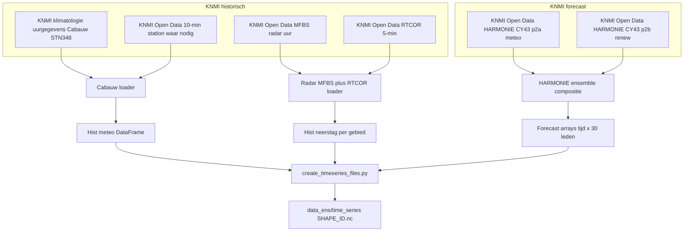

# HDSR Afvoervoorspelling met Neural Hydrology

Dit project gebruikt deep learning (LSTM) modellen om afvoeren te voorspellen voor de afvoergebieden van Hoogheemraadschap De Stichtse Rijn (HDSR). Het project is gebaseerd op de [neuralhydrology](https://github.com/neuralhydrology/neuralhydrology) bibliotheek.

## Overzicht

Het project bevat experimenten met verschillende LSTM varianten voor het voorspellen van afvoeren in 40 polders/afvoergebieden binnen het beheergebied van HDSR. De modellen gebruiken meteorologische data en gebiedskenmerken om accurate afvoervoorspellingen te maken.

## Projectstructuur

```
neural_hydrology/
├── README.md                 # Dit bestand
├── .gitignore               # Git ignore configuratie
├── configs/                 # Configuratie bestanden
│   ├── experiment_configs/  # Specifieke experiment configuraties
│   └── template_configs/    # Template configuraties
├── scripts/                 # Python scripts
│   ├── training/           # Training scripts
│   └── analysis/           # Analyse en evaluatie scripts
├── data/                   # Dataset
│   ├── attributes/         # Gebiedskenmerken van polders
│   ├── time_series/        # Tijdreeks data (voorbeelden)
│   └── hdsr_polders.txt    # Lijst van ids afvoergebieden
└── notebooks/              # Jupyter notebooks voor analyse
```

## Datasets

### Afvoergebieden
Het project werkt met 40 afvoergebieden van HDSR. De lijst staat in `data/hdsr_polders.txt`.

### Data bestanden
- **Attributes**: `polders_data_aangevuld.csv` - Gebiedskenmerken van alle polders
- **Time series**: NetCDF bestanden (`.nc`) met meteorologische en hydrologische tijdreeksen per polder
- **Voorbeelden**: Alleen AFVG1, AFVG13 en AFVG15 zijn meegeleverd als voorbeelden (vanwege bestandsgrootte)

## Model varianten

Het project test verschillende LSTM configuraties:

1. **MTSLSTM** - Multi-Timescale LSTM
2. **MTSLSTM + Embedding** - Met embedding layer voor categorische features
3. **MTSLSTM + One-Hot Encoding** - Met one-hot encoded features
4. **Statische Multi-Timescale LSTM** - Varianten met statische features

Elke variant heeft eigen configuratie bestanden in `configs/experiment_configs/`.

## Belangrijkste scripts

### Training
- `batch_train_single.py` - Batch training voor single LSTM model per afvoergebied
- `run_model.py` - Basis model training script voor een of meerdere configuraties

### Analyse
- `feature_optimalisatie.py` - Feature selectie en optimalisatie
- `hyperparameter_optimalisatie.py` - Hyperparameter tuning
- `best_model.py` - Evaluatie van beste modellen
- `map_hdsr.py` - Visualisatie van HDSR gebied

## Gebruik

### Installatie
```bash
# Installeer neuralhydrology
pip install neuralhydrology

# Of kloon de repository en installeer lokaal
git clone https://github.com/neuralhydrology/neuralhydrology.git
cd neuralhydrology
pip install -e .
```

### Training
```bash
# Train een model met een specifieke configuraties
python scripts/training/run_model.py

# Batch training voor single LSTM model per afvoergebied
python scripts/training/batch_train_single.py
```

### Analyse
```bash
# Feature optimalisatie
python scripts/analysis/feature_optimalisatie.py

# Hyperparameter tuning
python scripts/analysis/hyperparameter_optimalisatie.py
```

## Configuratie

Alle experiment configuraties staan in `configs/experiment_configs/`. Elke configuratie definieert:
- Model architectuur (LSTM variant)
- Input features
- Training parameters
- Data preprocessing
- Output metrics

## Resultaten

De training resultaten worden opgeslagen in een `runs/` folder (niet meegeleverd vanwege grootte). Elke run bevat:
- Getrainde model checkpoints
- Evaluatie metrics
- Visualisaties
- TensorBoard logs

## Samenstellen ensemble tijdreeksen (preprocessing)

Het script `scripts/preprocessing/create_timeseries_files.py` bouwt per afvoergebied (`SHAPE_ID`) één NetCDF in `data_ens/time_series/<SHAPE_ID>.nc` met **30 ensembleleden** per variabele (`neerslag_1` … `neerslag_30`, idem voor `temperatuur`, `u`, `v`, `straling`).

### Bronnen en volgorde

1. **Historisch meteo (Cabauw)** — KNMI **klimatologie uurgegevens** (station 348 Cabauw) + waar nodig aanvulling uit KNMI Open Data **10-minuut** stationdata: temperatuur, zonnestraling, wind als `u`/`v`.
2. **Historisch neerslag** — KNMI **MFBS** (radar, uur) gecombineerd met **RTCOR** (5-min → **uursom (mm)** per gebied; aggregatie met minimum-aantal 5-min stappen).
3. **Forecast** — KNMI Open Data **HARMONIE CY43**: composiet uit **twee datasets** (`harmonie_arome_cy43_p2a` meteo + `harmonie_arome_cy43_p2b` renew/straling), tot **30 leden** over een rollend 6-uurs venster (`ENSEMBLE_STARTTIME` in `neural_hydrology/.env`).

### Configuratie (`neural_hydrology/.env`)

- `KNMI_API_URL`, `KNMI_API_KEY` — Open Data API.
- `ENSEMBLE_STARTTIME` — `YYYYMMDDHH` UTC, oudste run in het 6-uurs composiet (uur “1”).
- `DOWNLOAD_ENSEMBLE` — `1` downloaden; `0` alleen lokale `.tar` in `data_ens/_tmp_harmonie/` gebruiken.

### Gedrag bij ontbrekende waarden (na merge historisch + forecast)

- **Temperatuur, straling, wind (`u`,`v`)**: korte **lineaire interpolatie** langs de tijd; maximum gap wordt bepaald door **`METEO_INTERP_LIMIT_HOURS`** in `create_timeseries_files.py`.
- **Neerslag**: resterende **NaN → 0** (neerslag is een **uursom per tijdstap**, dus in de praktijk **mm per uurstap**; in de NetCDF staat het `units`-attribuut momenteel als `"mm"`). Dit gedrag is aan/uit via `MissingDataConfig.neerslag_fill_nan_with_zero`.

### Overige instellingen in het script

- **`RTCOR_MAX_DOWNLOADS`** — maximum aantal RTCOR-bestandsdownloads per run (bescherming tegen te lange KNMI-pulls).

### Uitvoeren

```bash
# Conda-omgeving bijvoorbeeld: conda activate neuralhydrology
python neural_hydrology/scripts/preprocessing/create_timeseries_files.py --days 365
python neural_hydrology/scripts/preprocessing/create_timeseries_files.py --days 30 --basin-id AFVG1
```



## Notebooks

- `hyperparameter_importance.ipynb` - Analyse van hyperparameter importance en model performance

## Licentie

Dit project is ontwikkeld voor onderzoek binnen HDSR. Voor gebruik van de neuralhydrology bibliotheek, zie de [originele licentie](https://github.com/neuralhydrology/neuralhydrology/blob/master/LICENSE).

## Referenties

- Kratzert, F., et al. (2019). "Towards learning universal, regional, and local hydrological behaviors via machine learning applied to large-sample datasets." Hydrology and Earth System Sciences.
- [NeuralHydrology Documentation](https://neuralhydrology.readthedocs.io/)
