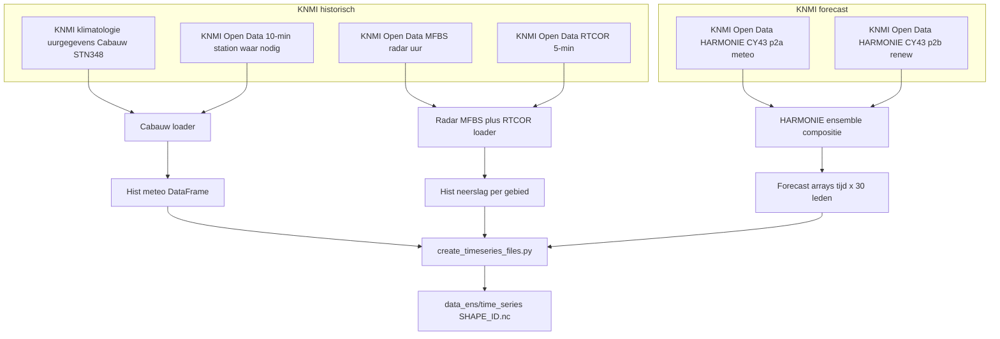

# HDSR Afvoervoorspelling met Neural Hydrology

Dit project gebruikt deep learning (LSTM) modellen om afvoeren te voorspellen voor de afvoergebieden van Hoogheemraadschap De Stichtse Rijn (HDSR). Het project is gebaseerd op de [neuralhydrology](https://github.com/neuralhydrology/neuralhydrology) bibliotheek.

## Overzicht

Het project bevat experimenten met verschillende LSTM varianten voor het voorspellen van afvoeren in 40 polders/afvoergebieden binnen het beheergebied van HDSR. De modellen gebruiken meteorologische data en gebiedskenmerken om accurate afvoervoorspellingen te maken.

**Twee workflows:**

- **Experiment / training** — HPO en retrain op Databricks (MLflow + Optuna), output in `runs/` of Volumes.
- **Operationeel** — KNMI-preprocessing → ensemble-inference (5-model bagging) → Unity Catalog → Power BI.

## Projectstructuur

De **Git repo-root** bevat projectconfiguratie en data; Python-code staat onder `src/neural_hydrology/` (gangbare src-layout).

```
neural_hydrology/                    # Git repo-root
├── pyproject.toml                   # requires-python >= 3.10
├── README.md
├── config.yml                       # NeuralHydrology run-config
├── requirements.txt
├── .env.example
├── jobs/                            # Entrypoints voor Databricks Jobs (ook lokaal)
│   ├── preprocess_ensembles.py
│   ├── run_ensembles.py
│   └── postprocess_ensembles.py
├── data/                            # Voorbeeld-/trainingsdata (zie data/README.md)
├── data_ens/                        # Operationele ensemble-input
├── runs/                            # Modelruns (lokaal, gitignored)
├── inference_runs/                  # Inference-output (gitignored)
├── notebooks/
├── powerbi/                         # Rapport + sample data
└── src/
    └── neural_hydrology/            # Python package (pip install -e .)
        ├── paths.py                 # Pad- en .env-resolutie
        ├── preprocessing/
        ├── training/
        ├── inference/
        ├── postprocessing/
        ├── analysis/
        ├── viz/
        └── utils/
```

## Datasets

### Afvoergebieden

Het project werkt met 40 afvoergebieden van HDSR. De lijst staat in `data/hdsr_polders.txt` (operationeel ook onder `data_ens/hdsr_polders.txt`).

### Data bestanden

- **Attributes**: `data/attributes/polders_data_aangevuld.csv` — gebiedskenmerken (operationeel: `data_ens/attributes/`)
- **Time series**: NetCDF (`.nc`) per polder onder `data/time_series/` (training) en `data_ens/time_series/` (operationeel)
- **Voorbeelden**: alleen AFVG1, AFVG13 en AFVG15 zijn meegeleverd (bestandsgrootte)
- **Let op**: de volledige trainings-`time_series/` staat op Databricks in een Volume (zie `config.yml`) en zit niet in deze repository. Zie ook [`data/README.md`](data/README.md).

## Model varianten

Het project test verschillende LSTM configuraties:

1. **MTSLSTM** — Multi-Timescale LSTM
2. **MTSLSTM + Embedding** — met embedding layer voor categorische features
3. **MTSLSTM + One-Hot Encoding** — met one-hot encoded features
4. **Statische Multi-Timescale LSTM** — varianten met statische features

De configuratie van een run staat in `config.yml`. Voor experimenten maak je hiervan doorgaans varianten (bijv. per model/feature-set).

## Belangrijkste scripts

Na `pip install -e .` start je package-modules met `python -m neural_hydrology.<module>`. Job-scripts draai je vanaf repo-root met `python jobs/<script>.py`.

### Training

| Module | Beschrijving |
|--------|--------------|
| `neuralhydrology.nh_run` (upstream CLI) | Enkele training: `train --config-file config.yml` |
| `utils.training.run_neural_hydrology_model` | Wrapper gebruikt door HPO/retrain |
| `training.hyperparameter_optimalisatie` | Optuna HPO + MLflow (Databricks) |
| `training.batch_train_model` | Retrain van gekozen HPO-trial (constanten bovenaan script) |

Er is geen `training.run_model` in deze repo; training loopt via upstream NeuralHydrology of de HPO/retrain-scripts.

### Preprocessing (operationeel)

| Module / script | Beschrijving |
|-----------------|--------------|
| `preprocessing.create_timeseries_files` | Bouwt `data_ens/time_series/<SHAPE_ID>.nc` met 30 HARMONIE-leden |
| `jobs/preprocess_ensembles.py` | Zelfde voor alle polders (`PREPROCESSING_DAYS`, default 365) |

### Inference (operationeel)

| Module / script | Beschrijving |
|-----------------|--------------|
| `jobs/run_ensembles.py` | 5 modellen + mediaan-bagging → `INFERENCE_RUNS_DIR/` |
| `inference.run_model` | Eén model (dev/debug), CLI `--run_dir` |

### Postprocess & visualisatie

| Module / script | Beschrijving |
|-----------------|--------------|
| `jobs/postprocess_ensembles.py` | NetCDF → Unity Catalog (Spark, alleen Databricks) |
| `postprocessing.export_ensemble_table` | Kernlogica voor postprocess-job |
| `analysis.plot_ensemble_forecast` | Plots uit `polders_hdsr_1h.nc` → `inference_runs/plots/` |
| `viz.qqplots`, `viz.nse_map` | Evaluatie na training |

`analysis.map_hdsr` is een interactief notebook-achtig script (ipywidgets), geen batch-CLI.

### Lokaal vs Databricks (jobs)

| Script | Lokaal | Databricks |
|--------|--------|------------|
| `jobs/preprocess_ensembles.py` | Ja (`KNMI_API_KEY`) | Ja |
| `jobs/run_ensembles.py` | Ja (`BEST_MODEL_DIR_1`…`_5`) | Ja |
| `jobs/postprocess_ensembles.py` | Nee (Spark) | Ja |

## Lokaal gebruik

### Installatie

Vereisten: **Python 3.10+**, KNMI API-sleutel voor preprocessing, optioneel CUDA voor training.

```bash
cd neural_hydrology          # Git repo-root (deze map)
python -m venv .venv
source .venv/bin/activate   # Windows: .venv\Scripts\activate
pip install -r requirements.txt
pip install -e .
cp .env.example .env
```

Code staat in `src/neural_hydrology/`; `config.yml`, `.env` en data staan op **repo-root**.

**Lokaal trainen:** `config.yml` wijst standaard naar Databricks Volumes. Pas voor lokaal gebruik minimaal `data_dir` en de `*_basin_file`-paden aan naar `data/` (relatief aan repo-root).

### Configuratie (`.env`)

Eén bestand op repo-root: `cp .env.example .env`. Paden worden opgelost via `neural_hydrology.paths` (`src/neural_hydrology/paths.py`).

**Regel:** shell-omgevingsvariabelen overschrijven `.env`. Relatieve paden (`data`, `data_ens`, …) zijn relatief aan `NEURAL_HYDROLOGY_ROOT`.

| Variabele | Lokaal | Databricks |
| --------- | ------ | ---------- |
| `NEURAL_HYDROLOGY_ROOT` | leeg (auto repo-root) | `/Workspace/Shared/neural_hydrology` |
| `DATA_DIR` | `data` | `/Volumes/dbw_datascience_tst_weu_001/default/data_neuralhydrology/input` |
| `DATA_ENS_DIR` | `data_ens` | `/Volumes/dbw_datascience_tst_weu_001/default/data_neuralhydrology/operationeel/input` |
| `INFERENCE_RUNS_DIR` | `inference_runs` | `/Volumes/.../output/inference` |
| `CONFIG_PATH` | `config.yml` | `/Workspace/Shared/neural_hydrology/config.yml` |
| `RUNS_DIR` | `runs` | `/Volumes/.../output` |
| `BEST_MODEL_DIR_1` … `_5` | verplicht voor `jobs/run_ensembles.py` | vijf run-mappen met `config.yml`; mediaan-bagging |
| `N_ENSEMBLES` | `30` | `30` |
| `OUTPUT_DIR` | `runs` | `/Volumes/.../output` |
| `BASE_CONFIG` | leeg (= `CONFIG_PATH`) | zelfde als `CONFIG_PATH` |
| `HPO_OUTPUT_DIR` | leeg (= `OUTPUT_DIR/HPO`) | leeg (= `OUTPUT_DIR/HPO`) |
| `RETRAIN_BASE_DIR` | leeg (= `OUTPUT_DIR/BATCH_RETRAIN`) | leeg (= `OUTPUT_DIR/BATCH_RETRAIN`) |
| `MLFLOW_TRACKING_URI` | leeg | `databricks` |
| `KNMI_API_URL` | `https://api.dataplatform.knmi.nl/open-data` | zelfde |
| `KNMI_API_KEY` | verplicht (preprocessing) | verplicht |
| `ENSEMBLE_STARTTIME` | optioneel; `YYYYMMDDHH` UTC | optioneel; oudste run in 6-uurs venster |
| `DOWNLOAD_ENSEMBLE` | `1` of `0` (cache `data_ens/_tmp_harmonie/`) | `1` of `0` |
| `PREPROCESSING_DAYS` | — | optioneel; default `365` in `jobs/preprocess_ensembles.py` |
| `LOG_LEVEL` | optioneel; default `INFO` | optioneel |
| `ENSEMBLE_FORECAST_TABLE` | — | verplicht voor postprocess; `catalog.schema.table` |

Zie ook inline uitleg in [`.env.example`](.env.example).

**Voorbeeld lokaal (preprocessing + training):**

```bash
pip install -e .
cp .env.example .env
python -m neural_hydrology.preprocessing.create_timeseries_files --days 30 --basin-id AFVG1
python -m neural_hydrology.training.run_model
```

**Databricks**

```bash
cd /Workspace/Shared/neural_hydrology
pip install -r requirements.txt
python -m neural_hydrology.training.hyperparameter_optimalisatie
```

**Van HPO naar operationele ensemble forecast (samenvatting):**

1. Draai `hyperparameter_optimalisatie` → kies trial in MLflow.
2. Pas constanten in `batch_train_model.py` aan (`EXPERIMENT_NAME`, `TRIAL_NAME`, …) en draai retrain.
3. Zet vijf run-mappen in `.env` als `BEST_MODEL_DIR_1` … `BEST_MODEL_DIR_5`.
4. Draai `jobs/run_ensembles.py` (en op Databricks `postprocess_ensembles.py`).

### Visualisatie inference

```bash
python -m neural_hydrology.analysis.plot_ensemble_forecast
```

## Databricks

Deze branch is bedoeld om het NeuralHydrology-framework te draaien op Databricks (paden onder `Workspace` en Catalog/Volumes, rekenkracht via Compute, MLflow via Jobs & Pipelines). Instantie in dit project: `dbw-datascience-tst-weu-001`.

### Installatie en update van repo in Databricks

#### Repo toevoegen als Git folder (eerste keer)

- **Workspace locatie kiezen**: ga naar *Workspace* en navigeer naar de plek waar je de projectfolder wilt hebben, bijv. onder `Shared` of onder `Users` → `rob.van.den.hengel@hdsr.nl`.
- **Git folder aanmaken**: rechtermuisknop op de map waarin je het project wilt plaatsen → *Create* → *Git folder*.
- **URL plakken**: plak de Git-URL van de repository bij *URL*.
- **Naam instellen**: pas indien nodig de *Name* aan zoals die in Databricks getoond wordt. Deze naam moet **uniek** zijn binnen die locatie in Databricks.
- **Aanmaken**: klik *Create Git folder* en selecteer (indien gevraagd) direct de juiste branch.
- **In dit project**: in dit project zijn folders gebruikt onder `Workspace/Shares/neural_hydrology` en `Workspace/Shares/neural_hydrology_fork`. `neural_hydrology_fork` is gebruikt vanwege beperkte rechten op het GitHub-account `hdsr-mid`, en zodoende om via een gesyncte fork te werken met het account `robvandenhengelhdsr`.

#### Repo updaten (na wijzigingen buiten Databricks)

- **Navigeer naar de Git folder**: ga in *Workspace* naar de Git folder van het project.
- **Open Git-menu**: klik op het Git-icoon rechts naast de naam van de Git folder (knop met Git-logo + branchnaam).
- **Lokale wijzigingen eerst veiligstellen (best practise)**: als er in Databricks lokale wijzigingen zijn, commit en push die eerst naar GitHub voordat je gaat pullen.
- **Branch kiezen**: selecteer linksboven de branch die je uit GitHub wilt ophalen/gaan gebruiken in Databricks.
- **Pull uitvoeren**: klik rechtsboven op *Pull* om de laatste wijzigingen op te halen.
- **Configureer `.env`**: zie [Configuratie (`.env`)](#configuratie-env) → Databricks.

#### Data Volume (input/output)

- **Dataset**: de repo bevat niet de trainingsdataset vanwege de omvang. Binnen Databricks zijn datasets beschikbaar via de *Catalog*.
- **Volume**: voor dit project is in de Catalog een Volume aangemaakt in de database `default` met de naam `data_neuralhydrology`.
  - **Input**: subfolder `input` bevat de benodigde gegevens (tijdseries & gebiedskenmerken) voor training.
  - **Output**: subfolder `output` is bedoeld voor het wegschrijven van modelresultaten.

#### Compute aanmaken of starten

- **Nieuwe compute**: ga naar *Compute* → *Create compute* en volg de instructies. Voor GPU-training kies je een cluster met CUDA/GPU runtime. De scripts schakelen automatisch tussen GPU/CPU op basis van `torch.cuda.is_available()`.
- **Bestaande compute starten**: ga naar *Compute* en klik op het *Play*-icoon (driehoek naar rechts) bij de gewenste compute (verschijnt bij hover).

#### Libraries installeren op de compute

- *Libraries* → *Install new* → `requirements.txt` uit de Git folder (`Workspace/Shared/neural_hydrology/requirements.txt`).
- Zorg dat `.env` op repo-root het Databricks-blok bevat (zie `.env.example`).

#### Script als Job draaien

- *Jobs & Pipelines* → *Create* → *Job* → *Python script* → pad bijv. `jobs/preprocess_ensembles.py`.
- Operationele keten: drie tasks of drie jobs in volgorde (zie hieronder).

### Uitvoeren van runs voor training (incl. opzet hyperparameter optimalisatie)

#### Training van één run

- **Configuratie**: `config.yml` in de Git repo-root is de centrale config.
  - **Data**: in deze branch wijst `data_dir` naar een Databricks Volume genaamd `/Volumes/dbw_datascience_tst_weu_001/default/data_neuralhydrology/input`.
  - **Outputs**: Op Databricks schrijft de repo outputs naar een Volume genaamd `/Volumes/dbw_datascience_tst_weu_001/default/data_neuralhydrology/output`.
- **Run starten** (na `pip install -e .` in de Git folder):

```bash
python -m neural_hydrology.training.run_model
```

#### Hyperparameter optimalisatie (Optuna + MLflow)

```bash
python -m neural_hydrology.training.hyperparameter_optimalisatie
```

- **MLflow**: het script zet `MLFLOW_TRACKING_URI=databricks` en logt naar een experiment onder `/Shared/...`.
- **Belangrijke instellingen in het script**:
  - `BASE_CONFIG`: pad naar de basis `config.yml` die per trial wordt aangepast.
  - `OUTPUT_DIR` en `RUNS_DIR`: outputlocaties op een Volume (standaard onder `/Volumes/dbw_datascience_tst_weu_001/default/data_neuralhydrology/output`).
  - `N_TRIALS`: aantal Optuna trials.
- **Wat er gebeurt**:
  - Per trial wordt een eigen config geschreven en als MLflow artifact gelogd.
  - NeuralHydrology wordt gestart via `run_neural_hydrology_model(config_path)`.
  - De output van elke trial komt in een eigen trial-map terecht, met daarbinnen de daadwerkelijke run-folder van NeuralHydrology.
  - De objective leest validatie-metrics uit TensorBoard logs, gebruikt tags zoals `valid/mean_nse_1D` en `valid/mean_nse_1h`, en optimaliseert op de maximale gemiddelde NSE over beide frequenties.
  - Na alle trials worden hyperparameter-importances en optimization history gelogd naar MLflow.
  - De Optuna study wordt opgeslagen in een SQLite database op `local_disk0`.

#### Batch retraining van een gekozen HPO-trial

Voor het opnieuw trainen van een specifieke HPO-trial met meerdere seeds:

```bash
python -m neural_hydrology.training.batch_train_model
```

- **MLflow**: het script zet `MLFLOW_TRACKING_URI=databricks` en logt de retrain-runs naar een apart MLflow experiment.
- **Belangrijke instellingen in het script**:
  - `EXPERIMENT_NAME`: naam van de HPO-experimentmap onder `.../output/HPO/`.
  - `TRIAL_NAME`: de trial-map die je wilt hertrainen, bijvoorbeeld `trial_28`.
  - `PATH_HPO`: pad naar de HPO-output waarin de gekozen trial staat.
  - `NUMBER_OF_RETRAININGS`: aantal keer dat het model opnieuw wordt getraind (met verschillende seeds).
  - `RETRAIN_BASE_DIR` en `DESTINATION_DIR`: outputlocaties voor de gekopieerde run en de nieuwe retrains.
  - `EVAL_OUTPUT_DIR`: map waarin evaluatieresultaten (NetCDFs) worden weggeschreven.
- **Wat er gebeurt**:
  1. Het script kopieert de gekozen trial naar een aparte retrain-locatie.
  2. Van het originele model worden de validatie-metrics uit TensorBoard gelezen en in MLflow gelogd.
  3. Het originele model wordt geëvalueerd op train, validation en test set; resultaten worden als NetCDF weggeschreven naar `eval_results/original/{period}/{basin}_{resolution}.nc`.
  4. Per retraining wordt een nieuwe config geschreven met een aangepaste seed, het model getraind, metrics gelogd, en geëvalueerd op alle drie de perioden.
  5. Na alle retrains wordt een **median ensemble** berekend: per basin en tijdresolutie wordt de mediaan van de voorspellingen over alle modellen (origineel + retrains) genomen.
  6. De ensemble-NSE per basin wordt gelogd naar MLflow, samen met gemiddelde en mediaan NSE over alle basins.
- **Outputstructuur**:
  ```
  DESTINATION_DIR/
  ├── trial_28/                         # Kopie van het originele model
  ├── retrain_1/                        # Retrain-folder (seed offset 1)
  │   └── trial_28_retrain_1_.../       # NeuralHydrology run-folder
  ├── retrain_2/                        # Retrain-folder (seed offset 2)
  │   └── trial_28_retrain_2_.../
  ├── ...
  └── eval_results/
      ├── original/
      │   ├── train/{basin}_1h.nc, {basin}_1D.nc
      │   ├── validation/...
      │   └── test/...
      ├── trial_28_retrain_1/
      │   ├── train/...
      │   ├── validation/...
      │   └── test/...
      ├── ...
      └── median_ensemble/{basin}_1h.nc, {basin}_1D.nc
  ```

### Operationeel verwachtingen

Databricks: (1) ensemble-tijdreeksen, (2) inference met bagging, (3) Unity Catalog.

#### 1) Preprocessing: ensemble tijdreeksen bouwen

- Het module `neural_hydrology.preprocessing.create_timeseries_files` bouwt per afvoergebied (`SHAPE_ID`) één NetCDF in `data_ens/time_series/<SHAPE_ID>.nc` met **30 ensembleleden** per variabele (`neerslag_1` … `neerslag_30`, idem voor `temperatuur`, `u`, `v`, `straling`, `streefpeil`).

- **Streefpeil** — constant over de volledige `date`-as: laatste niet-NaN waarde uit `DATA_DIR/time_series/<SHAPE_ID>.nc` (training), identiek in `streefpeil_1` … `streefpeil_30` (`units`: `mNAP`).

##### Bronnen en volgorde

1. **Historisch meteo (Cabauw)** — KNMI **klimatologie uurgegevens** (station 348 Cabauw) + waar nodig aanvulling uit KNMI Open Data **10-minuut** stationdata: temperatuur, zonnestraling, wind als `u`/`v`.
2. **Historisch neerslag** — KNMI **MFBS** (radar, uur) gecombineerd met **RTCOR** (5-min → **uursom (mm)** per gebied; aggregatie met minimum-aantal 5-min stappen).
3. **Forecast** — KNMI Open Data **HARMONIE CY43**: composiet uit **twee datasets** (`harmonie_arome_cy43_p2a` meteo + `harmonie_arome_cy43_p2b` renew/straling), tot **30 leden** over een rollend 6-uurs venster (`ENSEMBLE_STARTTIME` in `.env` op repo-root).

##### KNMI in `.env`

`KNMI_API_KEY` (verplicht), optioneel `ENSEMBLE_STARTTIME` (`YYYYMMDDHH` UTC), `DOWNLOAD_ENSEMBLE` (`1` = download, `0` = alleen cache in `data_ens/_tmp_harmonie/`).

##### Gedrag bij ontbrekende waarden (na merge historisch + forecast)

- **Temperatuur, straling, wind (`u`,`v`)**: korte **lineaire interpolatie** langs de tijd; maximum gap wordt bepaald door `**METEO_INTERP_LIMIT_HOURS`** in `create_timeseries_files.py`.
- **Neerslag**: resterende **NaN → 0** (neerslag is een **uursom per tijdstap**, dus in de praktijk **mm per uurstap**; in de NetCDF staat het `units`-attribuut momenteel als `"mm"`). Dit gedrag is aan/uit via `MissingDataConfig.neerslag_fill_nan_with_zero`.

##### Overige instellingen in het script

- `**RTCOR_MAX_DOWNLOADS`** — maximum aantal RTCOR-bestandsdownloads per run (bescherming tegen te lange KNMI-pulls).

##### Uitvoeren

```bash
python -m neural_hydrology.preprocessing.create_timeseries_files --days 365
python -m neural_hydrology.preprocessing.create_timeseries_files --days 30 --basin-id AFVG1
```

**Databricks Job:** `python jobs/preprocess_ensembles.py`


```mermaid
flowchart TD
  subgraph knmi_hist [KNMI historisch]
    knmi_uur[KNMI klimatologie uurgegevens Cabauw STN348]
    knmi_10m[KNMI Open Data 10-min station waar nodig]
    knmi_mfbs[KNMI Open Data MFBS radar uur]
    knmi_rtcor[KNMI Open Data RTCOR 5-min]
  end

  subgraph knmi_fc [KNMI forecast]
    knmi_p2a[KNMI Open Data HARMONIE CY43 p2a meteo]
    knmi_p2b[KNMI Open Data HARMONIE CY43 p2b renew]
  end

  knmi_uur --> cabauw[Cabauw loader]
  knmi_10m --> cabauw
  cabauw --> histMeteo[Hist meteo DataFrame]

  knmi_mfbs --> radar[Radar MFBS plus RTCOR loader]
  knmi_rtcor --> radar
  radar --> histPrec[Hist neerslag per gebied]

  knmi_p2a --> harmonie[HARMONIE ensemble compositie]
  knmi_p2b --> harmonie
  harmonie --> fcEns[Forecast arrays tijd x 30 leden]

  histMeteo --> orchestrator["create_timeseries_files.py"]
  histPrec --> orchestrator
  fcEns --> orchestrator
  orchestrator --> basinNc["data_ens/time_series SHAPE_ID.nc"]
```

#### 2) Inference: ensemble met getrainde modellen

**Operationeel:** `jobs/run_ensembles.py` — vijf runs (`BEST_MODEL_DIR_1` … `_5`), mediaan per HARMONIE-lid, output in `INFERENCE_RUNS_DIR/`.

**Operationele job (`jobs/run_ensembles.py`)** draait inference met **vijf** getrainde runs (`BEST_MODEL_DIR_1` … `BEST_MODEL_DIR_5` in `.env`). Per HARMONIE-ensemblelid wordt de **mediaan** over de vijf modelvoorspellingen genomen (model-bagging). Output: één NetCDF-set in `INFERENCE_RUNS_DIR/`, compatibel met postprocess en Power BI.

**Enkel model (dev/debug):** `neural_hydrology.inference.run_model` via CLI `--run_dir` (geen modelpad in `.env`).

- **Input (operationeel)**
  - **Modelruns**: `BEST_MODEL_DIR_1` … `BEST_MODEL_DIR_5` (verplicht; elk pad met `config.yml`)
  - **Data**: `DATA_ENS_DIR` → `data_ens/time_series/`
  - **Ensemble starttijd**: `ENSEMBLE_STARTTIME=YYYYMMDDHH` (UTC) in `.env` (optioneel)
  - **Aantal HARMONIE-leden**: `N_ENSEMBLES` in `.env` (default `30`)
- **Input (CLI, één model)**
  - `--run_dir <pad/naar/runs/<run_id>>`, optioneel `--basin_file`, `--data_dir`, `--out_dir`, `--n_ensembles`
- **Uitvoering**
  - Bepaalt automatisch een **testperiode** op basis van de NetCDF-periode en **warm-up** uit de trainingconfig.
  - Per model en per ensemblelid k = 1..N: inputs via `<variabele>_<k>` uit de NetCDF.
  - Bagging-job: mediaan over de vijf modellen per `(basin, datetime, ensemble_id)`.
- **Output**
  - `inference_runs/polders_hdsr_<freq>.nc` met groepen per basin en `<target>_sim_1` … `<target>_sim_<N>`
  - NetCDF-attributen bij bagging: `bagging_n_models=5`, `bagging_method=median`, `run_dirs=...`

##### Uitvoeren

```bash
# Operationeel: 5 modellen + mediaan-bagging (paden in .env)
python jobs/run_ensembles.py

python -m neural_hydrology.inference.run_model \
  --run_dir runs/<jouw_run_map> \
  --data_dir data_ens \
  --out_dir inference_runs \
  --n_ensembles 30
```

Zet in `BEST_MODEL_DIR_1` … `_5` (vijf verschillende run-mappen).

#### 3) Postprocess: ensemble-resultaat naar Unity Catalog

`jobs/postprocess_ensembles.py` leest `INFERENCE_RUNS_DIR/polders_hdsr_1h.nc` en schrijft alle basins en ensembleleden naar een Delta-tabel in Unity Catalog.

- **Input**: `polders_hdsr_1h.nc` (vast) onder `INFERENCE_RUNS_DIR`
- **Config**: `ENSEMBLE_FORECAST_TABLE` in `.env` (verplicht op Databricks), drie-delige naam `catalog.schema.table`
- **Refresh**: bij elke run eerst `TRUNCATE TABLE`, daarna volledige reload uit de NetCDF-periode
- **Kolommen**: `datetime`, `ensemble_id`, `afvoergeb_id`, `value`
- **Power BI**: rapport en handleiding in [`../powerbi/`](../powerbi/) (tabel `dbw_datascience_tst_weu_001.default.output_forecast`)

```bash
python jobs/postprocess_ensembles.py
```

**Volledige keten (Databricks Jobs):**

```bash
python jobs/preprocess_ensembles.py
python jobs/run_ensembles.py
python jobs/postprocess_ensembles.py
```

## Configuratie

`config.yml` definieert o.a. modelarchitectuur, features, training, preprocessing en metrics.

## Resultaten

Training: `runs/` (gitignored) met checkpoints, metrics, TensorBoard. Inference: `inference_runs/`; plots via `plot_ensemble_forecast`.

## Notebooks

- `hyperparameter_importance.ipynb` — hyperparameter importance
- `visualisatie_runs.ipynb` — vergelijking training runs

## Licentie

Dit project is ontwikkeld voor onderzoek binnen HDSR. Voor neuralhydrology: [originele licentie](https://github.com/neuralhydrology/neuralhydrology/blob/master/LICENSE).

## Referenties

- Kratzert, F., et al. (2019). "Towards learning universal, regional, and local hydrological behaviors via machine learning applied to large-sample datasets." Hydrology and Earth System Sciences.
- [NeuralHydrology Documentatie](https://neuralhydrology.readthedocs.io/)
- [KNMI HARMONI Documentatie](https://www.knmidata.nl/open-data/harmonie)
